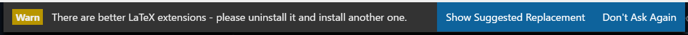

# [DEPRECATED] VSCode-LaTeX README

## Better LaTeX support is available -  Time to Upgrade

**I recommend you [un-install this extension](https://code.visualstudio.com/docs/editor/extension-gallery#_manage-extensions)** since it is no longer under development, and use one of the other options such as [LaTeX Workshop](https://marketplace.visualstudio.com/items?itemName=James-Yu.latex-workshop) in it's place. To highlight this to existing users upon activating the extension you will see a new warning message:  

## I want to keep using the extension - Stop Nagging Me

If you choose to continue to use the extension, click `Don't Ask Again` in the warning message.  Which will create a setting in your VS Code User Settings to suppress the message from coming up again.  Delete that setting `"LaTeX.StopAsking": true` when you do finally uninstall the extension.

We plan to un-publish the extension at some point to prevent new users from finding it when searching for LaTeX support.  When this happens any local copy you have will continue to work.  There will also be a .VSIX file in the [extension repository](https://github.com/Microsoft/vscode-latex) should you want to get it and [load it into VS Code](https://code.visualstudio.com/docs/editor/extension-gallery#_install-from-a-vsix).

# Change Log

## 1.0.0 
Added guidance to un-install extension based on other better options existing.

