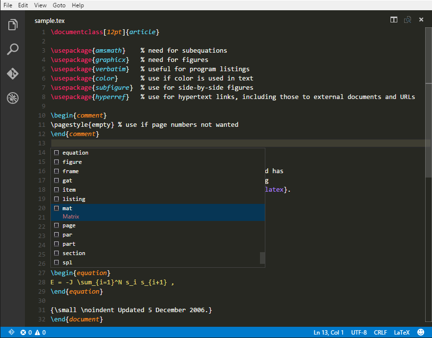

# VSCode-LaTeX README

An extension for [Visual Studio Code](https://code.visualstudio.com) that adds support for LaTeX.

- Syntax colorization
- Bracket Matching
- Snippets
- Line comments

Go from boring | To fun
---------------|--------
| 

This extension is based on the [tmBunble for LaTeX](https://github.com/textmate/latex.tmbundle).
